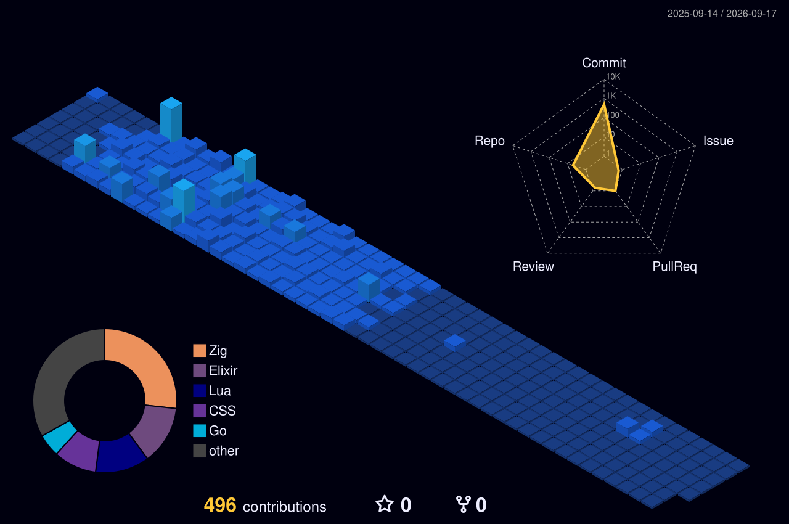

 
<h1 align="center">Hi  I'm <b>𝓗𝓾𝓶𝓪𝔂𝓸𝓸𝓷</b> Code name Proto </h1>

### <h3 align="center">Your Friendly Neighborhood Nerd from Pakistan </h3>
<hr/>

# 👤 About Me:
<ul><b>
  <li>🥱 Just another nerd obsessing over CLI tools and new stuff in the IT world</li>
  <li>👨🏻‍💻 Currently learning Zig to understand systems architecture and programming</li>
  <li>🧠 FullTime Linux User (Arch btw) because I have no life </li>
  <li>💭 Looking forward to getting into DevOps!</li>
  <li>🧩 Functional programming is the future (<i>still skeptical abt it tbh</i>) </li>
  <li>⚡ Prefer Speed over everything</li>
</b></ul>

## 🌐 Socials:
<a href="mailto:Humayoon04Syed@gmail.com"></a>
<a href="https://www.discordapp.com/users/detective.noir/"></a>
<a href="https://www.reddit.com/user/InternationalLie7754/"></a>

# 💻 My Daily Stack
<a href="https://ziglang.org/" target="blank"></a>
<a href="https://elixir-lang.org/" target="blank"></a>
<a href="https://www.lua.org/"></a>
<a href="https://archlinux.org/" target="_blank"></a>
<a href="https://distrobox.it/" target="_blank"></a>
<a href="https://neovim.io/" target="_blank"></a>
<a href="https://www.latex-project.org/" target="_blank"></a>
<a href="https://www.postgresql.org/"></a>
<a href="https://obsidian.md"></a>
<a href="https://www.podman.io/"></a>
<a href="https://k3s.io/"><a/>

## ✍ Bucket List:
<a href="https://rust-lang.org/" target="blank"></a>
<a href="https://www.raylib.com/" target="blank"></a>
<a href="https://www.vulkan.org/" target="blank"></a>

## 📊 GitHub Stats:
<br/>
<br/>

## ⌛️ Isometric Contribution 3d Chart


## 📈 Language Progress Bar
[](https://wakatime.com/@f864daa8-4bef-48c5-a5a1-f557eeeb05c1)
<!--START_SECTION:waka-->

```txt
Zig               3 hrs 48 mins   ████████████████████████░   96.58 %
Go                6 mins          ▓░░░░░░░░░░░░░░░░░░░░░░░░   02.71 %
Other             0 secs          ░░░░░░░░░░░░░░░░░░░░░░░░░   00.32 %
Protocol Buffer   0 secs          ░░░░░░░░░░░░░░░░░░░░░░░░░   00.29 %
jsonc             0 secs          ░░░░░░░░░░░░░░░░░░░░░░░░░   00.11 %
```

<!--END_SECTION:waka-->

<!-- Proudly created with GPRM ( https://gprm.itsvg.in ) -->
